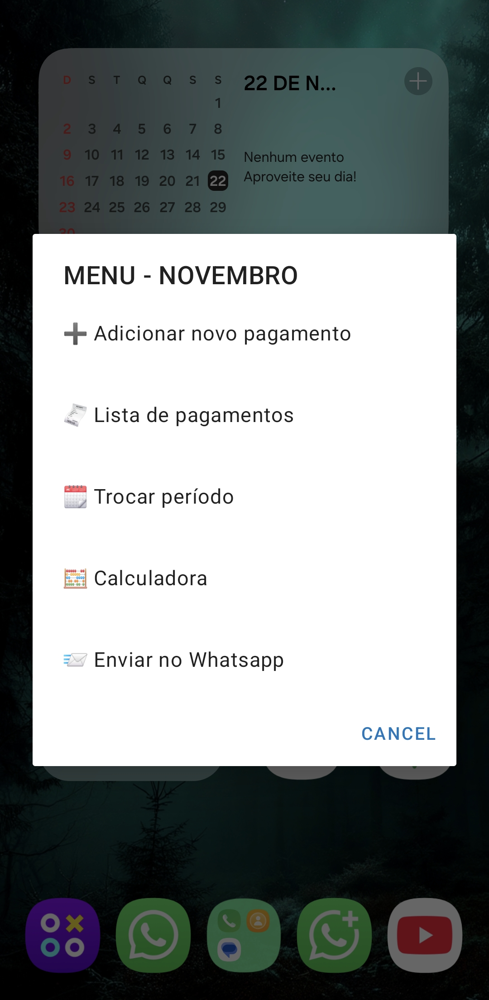
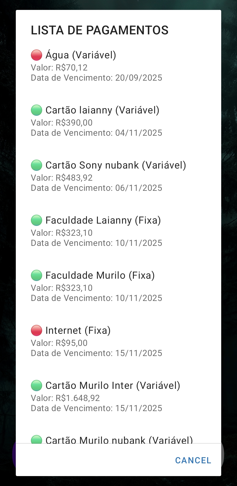
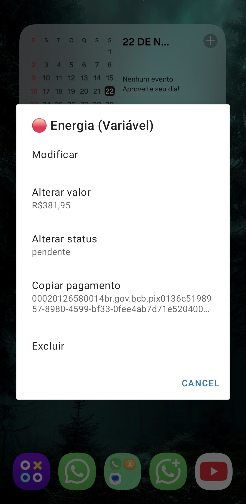
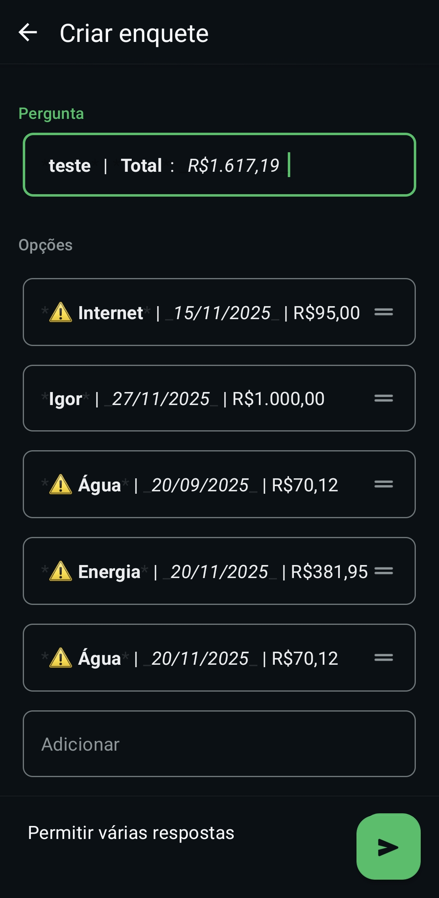

# 🧠 Controle de Contas Inteligente

Sistema completo de gestão financeira pessoal e familiar, desenvolvido em **Automate (LlamaLab)**, que transforma um dispositivo em um Servidor central para gerenciamento de contas. O projeto foca em lógica de previsão e sincronização multi-usuário com alta integridade de dados.

## 🚀 Destaques de Arquitetura

### 1. Sincronização Segura e Multi-Usuário
* **Comunicação Servidor/Cliente:** Utiliza a arquitetura Servidor/Cliente para sincronizar dados em tempo real via **Cloud Message** (Firebase).
* **Segurança de Setup:** O processo de configuração do Servidor utiliza criptografia **SHA256** para criar uma chave cipher, garantindo que apenas usuários autorizados possam ler e alterar o banco de dados.
* **Gestão de Estado:** Exibe mensagens de feedback específicas durante o uso (ex: `⏳️ Salvando... ⌛️`, `🗑️ Deletando Pagamento... ⌛️`), garantindo que o usuário saiba que os dados estão sendo sincronizados.

### 2. Previsão Inteligente (Smart Lookahead)
* **Alerta Contextual:** Notifica o usuário no **primeiro desbloqueio de tela** (após as 05:00 AM) sobre contas vencidas ou prestes a vencer (7 dias).
* **Correção de Ponto Cego:** Implementação de lógica avançada para prever contas **fixas** que vencerão nos primeiros 7 dias do mês seguinte.

### 3. Lógica de Reciclagem e Pagamento Refinada
* **Reciclagem Adaptativa:** O sistema só apaga a forma de pagamento (boleto ou pix copia e cola) se o campo for longo (indicando código de uso único), preservando outras formas de pagamento.
* **UI/UX:** Nomenclatura dos tipos de conta atualizada para maior clareza: **Fixa, Variável** e **Pontual**.

## 🎨 Design e Experiência do Usuário (UX)

* **Hierarquia de Status Visual:** Cores e ícones dão feedback imediato na lista de pagamentos:
    * 🔵 **Azul:** Indicam **previsões futuras** (próximo mês).
    * ⚠️ **Alerta de Valor:** Ícone ao lado de valores R$0,00, lembrando o usuário de lançar a fatura.
* **Visual Limpo:** Uso de parênteses no título (`Internet (Fixa)`) para economizar espaço e melhorar a leitura.

## 📸 Galeria do Projeto

### Menu e Gestão
O sistema oferece um menu centralizado e uma visualização clara de todas as despesas.

  
   

### Funcionalidades Avançadas
Controle total sobre cada item e integração nativa gerando enquetes automáticas no WhatsApp.

  
  

## 🛠 Stack Tecnológica

* **Plataforma:** Automate (LlamaLab).
* **Banco de Dados:** SQLite (com lógica de migração mensal).
* **Comunicação:** Cloud Message (Firebase) e SHA256.
* **Automação de Interface:** Utiliza **XPath / UI Automation** para interagir com elementos da tela do WhatsApp e criar enquetes formatadas.

## ⚙️ Instalação e Configuração Inicial

> ⚠️ **Requisito Importante:** Devido à complexidade do sistema, é necessário possuir a versão **Premium** do Automate (pagamento único) para importar e executar o fluxo.

### Passo 1: Instalação
1.  Baixe o [Automate](https://play.google.com/store/apps/details?id=com.llamalab.automate) na Google Play Store.
2.  Baixe o arquivo `.flo` deste repositório.
3.  No app, vá em **Import** e selecione o arquivo.
4.  Conceda todas as permissões solicitadas (Armazenamento, Sobreposição de Tela, Acessibilidade).

### Passo 2: Configuração do Servidor (Primeiro Uso)
1.  Ao rodar o fluxo do servidor pela primeira vez, ele verificará a ausência do arquivo do email do servidor.
2.  O sistema irá pedir para configurar um **E-mail Google** e uma **Senha**.
3.  A senha será usada para gerar a chave de criptografia **SHA256**, garantindo a segurança do canal de comunicação Servidor/Cliente.
4.  Após a validação, o arquivo de login será criado e o dispositivo será o **Servidor Mestre** da família.

## 🔋 Dica para Economizar Armazenamento

A complexidade deste fluxo fará com que o **histórico de execução (log do flow)** cresça rapidamente, consumindo armazenamento desnecessariamente.

**Recomendação:**
Para otimizar o uso e a performance, desative o registro de atividades do flow:

1.  Abra o aplicativo **Automate** e selecione o fluxo **Controle de Contas Inteligente**.
2.  Clique no **ícone do Histórico/Log** (a "notinha" riscada no canto superior direito da tela do fluxo).
3.  Dentro do menu de histórico, desative a opção **Logging**.

Deixe o log ativado apenas durante a fase de debug (resolução de problemas).

---
*Desenvolvido por Murilo*
